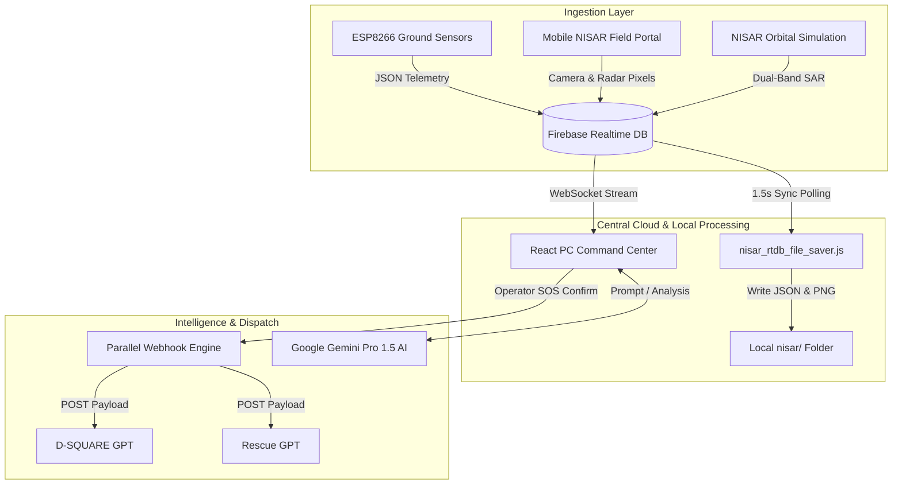

# 🛰️ D-SQUARE 2.0 — Multi-Modal AI Fusion & Disaster Alert Dashboard

Production-grade disaster-monitoring system deployed on **Netlify** as a static React + Vite Single Page Application (SPA). Integrates **Firebase Realtime Database** as a live cloud bridge connecting **ESP8266 ground hardware sensors**, **Mobile NISAR Satellite optics**, **Google Gemini Pro 1.5 Multi-Modal AI**, and **Local PC Disk Storage**.

---

### 🌐 Live Production Deployment

* 🚀 **Live Production Netlify URL**: [https://inspiring-tarsier-03e328.netlify.app](https://inspiring-tarsier-03e328.netlify.app)
* 📱 **Mobile NISAR Portal**: [https://inspiring-tarsier-03e328.netlify.app/mobile-nisar](https://inspiring-tarsier-03e328.netlify.app/mobile-nisar)
* 🤖 **D-SQUARE Structural GPT**: [https://inspiring-tarsier-03e328.netlify.app/dsquare-gpt](https://inspiring-tarsier-03e328.netlify.app/dsquare-gpt)
* 🚑 **Rescue GPT (First Responder Advisor)**: [https://inspiring-tarsier-03e328.netlify.app/rescue-gpt](https://inspiring-tarsier-03e328.netlify.app/rescue-gpt)
* 🚨 **Emergency Alert Center**: [https://inspiring-tarsier-03e328.netlify.app/alert-center](https://inspiring-tarsier-03e328.netlify.app/alert-center)

---

## 🚀 Key Architectural Features

1. **Mobile NISAR Satellite & Dual-Band SAR Physics Engine**:
   - Ingests dual-frequency Synthetic Aperture Radar (SAR) metrics:
     - **$L$-Band Radar ($1.25\,\text{GHz}$)**: Sub-surface moisture and land slope deformation ($\text{mm/year}$).
     - **$S$-Band Radar ($3.20\,\text{GHz}$)**: Surface canopy roughness and vegetation scatter.
     - Multi-spectral bands (NIR, SWIR, Thermal) and real-time smartphone camera captures.

2. **Local PC Disk Auto-Saver Daemon (`nisar/` Folder)**:
   - Includes a Node.js daemon (`scripts/nisar_rtdb_file_saver.js`) that continuously listens to Firebase RTDB.
   - Auto-saves satellite pixel JSON arrays and binary camera photos directly to local PC storage:
     - `nisar/latest_nisar_data.json`
     - `nisar/latest_nisar_capture.png`
     - Timestamped historical snapshots (`nisar/nisar_pixel_<timestamp>.json`).

3. **Firebase Realtime Cloud Bridge**:
   - WebSocket streaming between ground ESP8266 nodes, mobile field phones, PC dashboards, and AI services.

4. **Multi-Agent Parallel Webhook SOS Dispatch**:
   - Authorizing an SOS alert dispatches parallel HTTP POST payloads to **D-SQUARE GPT** and **Rescue GPT** for immediate tactical emergency response.

5. **Browser Sound Synthesis**:
   - Uses Web Audio API sound synthesis ($880\,\text{Hz}$ and $1046.5\,\text{Hz}$) for emergency audio beeps without external MP3 dependencies.

---

## 📂 System Data Flow Architecture



---

## 📂 Firebase Realtime Database Structure

```json
{
  "nodes": {
    "D-SQUARE_NODE_01": {
      "telemetry": {
        "node_id": "D-SQUARE_NODE_01",
        "temperature": 26.5,
        "humidity": 55.0,
        "soil_moisture": 42.0,
        "soil_raw": 850,
        "mq2_gas": 0,
        "flame": 0,
        "disaster_type": "none",
        "updated_at": 1780000000000
      },
      "hardware_alert": {
        "event_id": "EVT-HW-123456",
        "event_status": "ACTIVE",
        "disaster_type": "fire",
        "severity": "CRITICAL",
        "confidence": 0.95,
        "requires_operator_verification": true
      }
    }
  },
  "nisar": {
    "l_band_db": -14.5,
    "s_band_db": -8.2,
    "coherence": 0.42,
    "deformation_mm_yr": -34.8,
    "disaster_type": "landslide",
    "risk_level": "HIGH",
    "confidence_percent": 92.8,
    "captured_image": "data:image/png;base64,..."
  },
  "incidents": {
    "DSQ-SOS-001": {
      "incident_id": "DSQ-SOS-001",
      "status": "SOS_ACTIVE",
      "verified_by": "operator@dsquare.gov.in",
      "dispatch": {
        "dsquare_gpt": "DISPATCHED",
        "rescue_gpt": "DISPATCHED"
      }
    }
  }
}
```

---

## 🛠️ Local Setup & Execution

### 1. Install Dependencies
```bash
npm install
```

### 2. Configure Environment Variables
Copy `.env.example` to `.env`:
```bash
cp .env.example .env
```
Ensure your Firebase configuration keys are populated in `.env`:
```env
VITE_FIREBASE_API_KEY=your_api_key
VITE_FIREBASE_DATABASE_URL=https://d-sqaure-default-rtdb.firebaseio.com
VITE_GEMINI_API_KEY=your_gemini_key
```

### 3. Start Local Development Server
```bash
npm run dev
```
Open [http://localhost:5001](http://localhost:5001) in your browser.

### 4. Start Local NISAR File Saver Daemon
To automatically save incoming satellite radar pixels and camera frames to `nisar/`:
```bash
node scripts/nisar_rtdb_file_saver.js
```

---

## 🌐 Netlify Deployment Commands

Build and deploy directly via Netlify CLI:

```bash
# 1. Production Build
npm run build

# 2. Deploy to Netlify
npx netlify deploy --prod --dir=dist
```

---

## 🔌 ESP8266 Microcontroller Hardware Pinout

- **DHT11 (Temp & Humidity)**: Pin D5 (GPIO14)
- **Capacitive Soil Moisture**: Pin A0 (Analog)
- **MQ-2 Smoke/Gas Sensor**: Pin D6 (GPIO12)
- **IR Flame Sensor**: Pin D2 (GPIO4)
- **Piezo Buzzer**: Pin D4 (GPIO2)
- **Red Alert LED**: Pin D3 (GPIO0)
- **Green Status LED**: Pin D1 (GPIO5)
