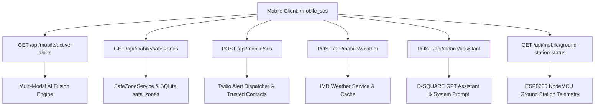

# D-SQUARE GPT — Mobile Satellite, Weather & Disaster Assistant

## Mobile Public Safety & Intelligence Module Documentation

**D-SQUARE GPT** is a mobile-first satellite remote-sensing, monsoon weather, and ground station disaster safety application integrated into the D-SQUARE 2.0 Disaster Surveillance platform. It provides real-time ground station sensor telemetry (`ESP8266_NODE_01`), ISRO Bhuvan / NISAR SAR / Sentinel satellite earth observation knowledge, IMD Indian monsoon forecasts, GPS location tracking relative to active hazard zones, safe shelter navigation, one-touch 112 dialing, emergency location sharing with saved trusted contacts, and a location-aware GPT Intelligence Assistant.

---

## Technical Architecture & Backend Endpoints



---

## Configuration & Environment Variables

Configure environment variables on the backend server (e.g. in `.env` or system environment):

### 1. GPT Safety Assistant Credentials
```bash
# Set OpenAI API key for GPT Safety Assistant
export OPENAI_API_KEY="your-openai-api-key-here"
```
> *Note: If `OPENAI_API_KEY` is omitted, D-SQUARE SOS seamlessly switches to the deterministic Safety Rule Engine.*

### 2. India Meteorological Department (IMD) Credentials
```bash
export IMD_API_KEY="your-imd-official-api-key"
export IMD_ENDPOINT_URL="https://api.imd.gov.in/v1/forecast"
```
> *Note: If IMD credentials are omitted, the app displays `"Official weather feed unavailable"` without fabricating false weather reports.*

### 3. Twilio Emergency Dispatcher Credentials
```bash
export TWILIO_ACCOUNT_SID="your-twilio-sid"
export TWILIO_AUTH_TOKEN="your-twilio-auth-token"
export TWILIO_PHONE_NUMBER="+18005550199"
```

---

## Geolocation Privacy & Data Retention

- **Permission Flow**: Browser geolocation permission is requested only after clear user consent.
- **Ephemeral Storage**: Geolocation logs in `mobile_location_logs` expire automatically after 24 hours via `cleanup_expired_location_logs()`.
- **Consent Enforcement**: `POST /api/user/location` returns HTTP `403 Forbidden` if `consent=false`.
- **User Control**: Users can revoke location access at any time via device settings.

---

## Emergency Safety Disclaimers & Truth Rules

1. **Non-Replacement Notice**: D-SQUARE SOS and AI assistants **do not replace** Police, Fire Services, NDMA, SDMA, IMD, or local district authorities.
2. **Indian Emergency Action**: All emergency call buttons trigger `tel:112` opening the user's native phone dialer. The application **never** automatically contacts 112 without human dialer confirmation.
3. **Emergency Call Triggers**: The GPT Assistant automatically recommends calling 112 whenever a user mentions entrapment, injuries, nearby fire, or rising floodwaters.
4. **Data Mode Badging**:
   - `VERIFIED`: Live satellite and sensor data active.
   - `PARTIAL`: Limited sensor coverage.
   - `DEMO`: Simulated test environment (*"DEMO MODE — No real emergency alert has been issued."*).

---

## Verification & Automated Testing

To run the full suite of unit and integration tests:

```powershell
.venv\Scripts\python.exe test_mobile_sos.py
.venv\Scripts\python.exe test_upload_compare.py
.venv\Scripts\python.exe test_historical_pixel.py
```
