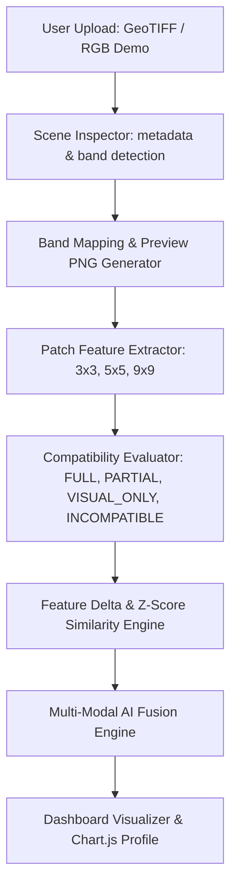

# D-SQUARE 2.0 — Satellite Disaster Scene Upload & Comparison Module

## Overview

The **Satellite Disaster Scene Upload & Comparison Module** empowers dashboard operators to upload historical and current satellite imagery, perform multi-spectral or visual spatial patch comparisons ($3 \times 3, 5 \times 5, 9 \times 9$), extract 16 feature vectors, evaluate scene compatibility, detect baseline anomalies, and incorporate findings into the D-SQUARE 2.0 Multi-Modal AI Fusion Engine.

---

## Technical Architecture & Workflow



---

## Scientific Rules & Data Integrity Principles

1. **Strict Metadata Verification**:
   - Files are NEVER labeled as *"NISAR data"* or *"ISRO verified"* unless metadata confirms origin.
   - Uploaded scenes default to `UPLOADED_UNVERIFIED` until operator or satellite registry verification.

2. **Spectral Index Calculation Safeguards**:
   - Physical spectral indices (`NDVI`, `NDWI`, `MNDWI`, `NBR`, `LST`) require verified band mappings or multi-band GeoTIFF formats.
   - Ordinary RGB images (`.png`, `.jpg`, `.jpeg`) are classified as `IMAGE-ONLY DEMO` / `VISUAL_ONLY`. Physical spectral index calculations return `null` / `N/A` to prevent fake science calculations.

3. **Autonomous Emergency Alert Controls**:
   - Scene upload and scene comparison analyses **NEVER autonomously trigger Twilio SMS alerts**.
   - Emergency dispatches require live ground sensor confirmation (ESP8266 telemetry, vibration/tilt thresholds, flame/smoke signals).

---

## API Endpoints Reference

| HTTP Method | Route | Description |
| :--- | :--- | :--- |
| `POST` | `/api/upload/historical-scene` | Uploads and processes historical satellite disaster scene. |
| `POST` | `/api/upload/current-scene` | Uploads and processes current satellite observation scene. |
| `GET` | `/api/uploaded-scenes` | Returns list of stored uploaded scenes (filter by `type=historical\|current\|all`). |
| `DELETE` | `/api/uploaded-scenes/<scene_id>` | Deletes scene and preview files from SQLite database and storage. |
| `POST` | `/api/compare-uploaded-scenes` | Performs patch feature comparison between selected scenes. |
| `GET` | `/api/scene-preview/<scene_id>` | Serves preview PNG thumbnail image safely. |

---

## Verification & Testing

To run the automated unit and integration tests:

```bash
.venv\Scripts\python.exe test_upload_compare.py
.venv\Scripts\python.exe test_historical_pixel.py
```
